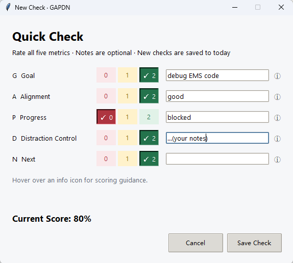
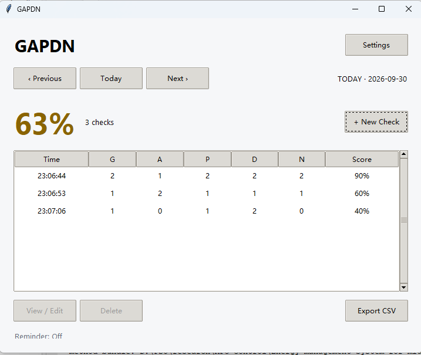
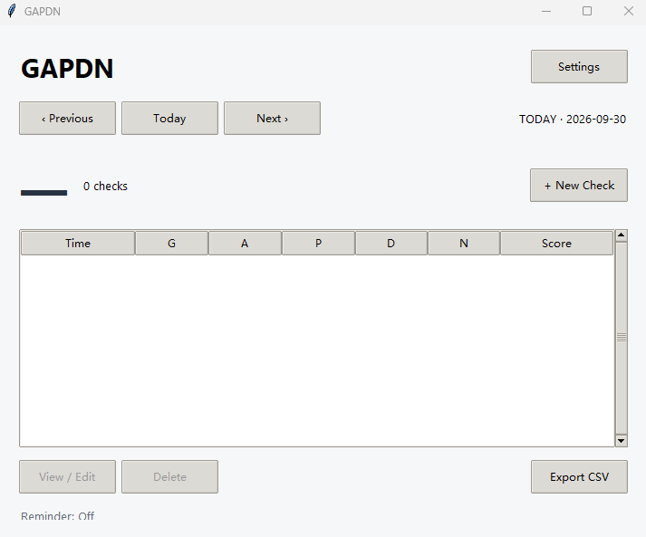
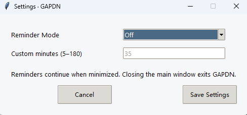

# GAPDN — A Lightweight Personal Execution Monitor

**Goal → Alignment → Progress → Distraction Control → Next**

GAPDN is a small Windows desktop app for checking whether your work is still moving toward your main goal. At a natural break or a gentle reminder, rate five aspects of your current work, optionally add a few notes, and continue working.

Its guiding principle is simple:

> The monitoring system should consume far less attention than the behavior it monitors.

A check is designed to take only a few dozen seconds. The purpose is to make your direction, progress, and next action visible with very little effort.

**Portable Windows EXE · Fully offline · Local JSON storage · Optional reminders · CSV export**

## Get Started

1. Download [GAPDN V0.1 for Windows](./GAPDN-v0.1-Windows-portable.zip).
2. Extract the ZIP into a writable folder, such as a folder in Documents.
3. Double-click `GAPDN.exe`.
4. Click **+ New Check**, choose a score for each of the five metrics, and select **Save Check**.
5. Open **Settings** if you would like periodic reminders. Reminders are off by default.

The packaged app requires no Python installation, internet connection, account, or administrator privileges. It is intended for Windows 10 and Windows 11; the supplied build is for 64-bit Windows.

On first launch, GAPDN creates `gapdn_data.json` beside the EXE. Keep the executable in a folder where you can write files, and extract the ZIP before running it.

## Why GAPDN?

It is possible to spend a long time working while losing sight of what matters: the main goal becomes vague, low-value activities take over, or the next useful action remains unclear. GAPDN provides a brief opportunity to notice these changes while you are working.

Each check asks five practical questions:

- **Goal:** Is my main goal clear?
- **Alignment:** Are my current actions serving that goal?
- **Progress:** Have I made meaningful progress during this period?
- **Distraction Control:** Have I kept unrelated tasks and competing goals from taking over?
- **Next:** Do I know the next important action?

You can use the app during coding, research, writing, studying, or other focused work. Checks are self-reported snapshots of your work state; GAPDN does not observe your screen or automatically measure your activity.

## The Five Metrics

Every metric uses the same three-point scale: **0 = Red**, **1 = Yellow**, and **2 = Green**.

| Metric | 0 — Red | 1 — Yellow | 2 — Green |
| --- | --- | --- | --- |
| **G — Goal** | The main goal is unclear. | The goal is vague, or several goals compete for attention. | One clear main goal is defined. |
| **A — Alignment** | Most actions are off target. | There is some drift or low-value activity. | Actions consistently support the main goal. |
| **P — Progress** | No meaningful progress has been made. | Some progress has been made. | Progress is clear and observable. |
| **D — Distraction Control** | Other tasks or goals have taken over. | Distractions occurred, but you recovered. | You stayed on track or parked new goals for later. |
| **N — Next** | The next step is unknown. | You have a rough idea of the next step. | The next important action is clear. |

**D measures control over distractions. A higher D score means better control.**

No rating is selected automatically. You must choose all five scores before saving, but every note field can remain empty.

## A Quick Check

Click **+ New Check** to open the scoring window. Choose one colored button per row. A check mark highlights the selected score, and **Current Score** updates once all five metrics are rated.

Use the optional single-line notes for brief context: your current goal, what you completed, a blocker, a distraction, or the next action. Hover over an info icon to see the scoring guidance in the reserved area below the inputs.



*This example has G = 2, A = 2, P = 0, D = 2, and N = 2, giving a Check Score of 80%. Progress can be blocked even when the other aspects of work are clear.*

Saving records the current local date and time and immediately updates the main view. Canceling closes the check without creating a record.

## How Scoring Works

### Check Score

The five metrics have equal weight:

```text
Raw Score   = G + A + P + D + N
Check Score = Raw Score / 10 × 100%
```

For example, `2 + 2 + 1 + 1 + 2 = 8`, so the Check Score is **80%**.

### Daily Score

Daily Score is the arithmetic mean of all Check Scores recorded for that date:

```text
Daily Score = sum of that day's Check Scores / number of checks
```

There is no time weighting. The displayed daily percentage is rounded to a whole number. In the screenshot below, checks of 90%, 60%, and 40% average to approximately **63%**.



The daily score uses a simple color cue:

| Daily Score | Display color |
| --- | --- |
| 90–100% | Green |
| 60% to below 90% | Yellow |
| Below 60% | Red |

When a date has no checks, the score displays **—** and the count displays **0 checks**. No records is different from a recorded score of zero.



## Browse, Edit, and Delete Records

The main window shows the selected date's Daily Score, check count, and saved records. Each row includes the time, all five metric scores, and the Check Score.

- Use **‹ Previous**, **Today**, and **Next ›** to switch dates.
- Select a record and click **View / Edit**, or double-click the row, to view its notes and change its ratings.
- Editing preserves the original date and time and recalculates the scores.
- Select a record and click **Delete** to remove it after confirmation.

Adding, editing, or deleting a record updates the summary immediately. New checks are saved to the current local date, even if you were browsing an earlier date. If the app is displaying today when midnight passes, it advances to the new day automatically.

## Gentle Reminders

Open **Settings** to choose a reminder mode:

| Mode | Behavior |
| --- | --- |
| **Off** | No automatic reminders; this is the default. |
| **Every 30 min** | A fixed 30-minute interval. |
| **Every 45 min** | A fixed 45-minute interval. |
| **Every 60 min** | A fixed 60-minute interval. |
| **Random 25–45 min** | A new random whole-minute interval is drawn for each cycle. |
| **Custom fixed interval** | A whole number from 5 to 180 minutes. |



When a reminder is due, a small, silent window offers two choices:

- **Check Now:** Open a check. Saving or canceling schedules the next reminder cycle.
- **Skip:** Close the reminder and schedule the next cycle without creating a record.

Closing the reminder window has the same effect as Skip. Unanswered reminders do not stack. If a check window is already open when a timer expires, GAPDN schedules another interval instead of opening a second check.

Saving reminder settings immediately resets the timer using the new settings. Minimizing the main window keeps the app and reminders running; closing the main window exits the app. While the computer sleeps, reminders cannot run. On resume, an overdue timer can be handled without replaying multiple missed reminders.

## Local Data and Privacy

GAPDN runs entirely on your computer. It has no account system, cloud synchronization, telemetry, or network service. Records and reminder settings are stored in a human-readable JSON file:

```text
Your GAPDN folder/
├── GAPDN.exe
└── gapdn_data.json
```

The file is created automatically. Saves use a temporary file and atomic replacement to reduce the risk of incomplete writes. If the data file is empty or damaged, GAPDN preserves it as `gapdn_data_corrupted_<timestamp>.json`, displays a warning, and creates a new empty data file. Write errors are reported rather than treated as successful saves.

To back up or move your records, copy `gapdn_data.json` along with the executable. To update the app, close it and replace the EXE while keeping that data file. Avoid editing the same data file through multiple running instances.

## Export to CSV

Click **Export CSV** to export either the displayed date or all saved records, then choose where to save the file.

The export includes:

```text
Date, Time, G, G Note, A, A Note, P, P Note,
D, D Note, N, N Note, Score
```

CSV files use UTF-8 with BOM for compatibility with international text in Excel. Exporting gives you a simple way to keep an archive or review the data in a spreadsheet. Canceling the export does not write a file.

## Run from Source

The source version uses **Python 3, Tkinter, and the Python standard library**. It has no third-party runtime dependencies.

If you are using the source distribution, open a terminal in the folder containing `gapdn.py` and run:

```bat
python gapdn.py
```

Your Python installation must include Tcl/Tk support. When running from source, the data file is stored beside `gapdn.py`.

## Build a Portable Windows EXE

On Windows, install PyInstaller and run the supplied build script from the source folder:

```bat
python -m pip install pyinstaller
build.bat
```

You can also double-click `build.bat`. If PyInstaller is missing, the script attempts to install it. Internet access is needed for dependency installation, but the finished app works offline.

The build produces:

```text
dist/GAPDN.exe
```

It is a single executable with no console window. End users do not need to install Python.

## Scope of V0.1

GAPDN focuses on a small loop:

**Check your goal → Check your actions → Check your progress → Check distractions → Choose your next step → Continue working.**

The current version includes five-metric checks, optional notes, daily summaries, record editing and deletion, date navigation, configurable reminders, local storage, and CSV export. It keeps task lists, project management, Pomodoro sessions, AI features, and complex analytics outside that loop.

The aim is low-friction self-supervision: a brief pause that helps you see where you are and what to do next.
